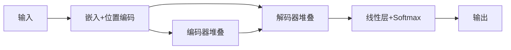

# Day 4

## Transformer模型核心总结

### 一、核心特点

1. **纯注意力机制**：完全取代RNN/CNN
2. **并行计算**：显著提升训练效率
3. **长距离依赖**：解决长序列建模问题
4. **模块化设计**：编码器-解码器结构

### 二、架构图解



## 三、核心组件

### 1. 自注意力机制

```python
scores = Q @ K.T / sqrt(d_k)
attn = softmax(scores)
output = attn @ V
```

### 2. 多头注意力

```python
class MultiHeadAttention(nn.Module):
    def __init__(self, d_model, num_heads):
        # 线性投影层初始化
    def forward(self, Q, K, V):
        # 分割多头→计算注意力→拼接结果
```

### 3. 位置编码

```python
PE(pos,2i) = sin(pos/10000^(2i/d_model))
PE(pos,2i+1) = cos(pos/10000^(2i/d_model))
```

### 4. 前馈网络

```python
class PositionwiseFeedForward(nn.Module):
    def __init__(self, d_model, d_ff):
        self.linear1 = Linear(d_model, d_ff)
        self.linear2 = Linear(d_ff, d_model)
```

## 四、完整架构

```python
class Transformer(nn.Module):
    def __init__(self, src_vocab, tgt_vocab, d_model, n_layers):
        self.encoder = EncoderStack(n_layers)
        self.decoder = DecoderStack(n_layers)
    
    def forward(self, src, tgt):
        # 编码器处理源序列
        # 解码器使用编码输出生成目标序列
```

## 五、关键变体

| 模型 | 架构特点     | 典型应用      |
| :--- | :----------- | :------------ |
| BERT | 双向编码器   | 文本分类/问答 |
| GPT  | 自回归解码器 | 文本生成      |
| T5   | 统一编解码   | 文本转换任务  |
| ViT  | 图像分块处理 | 计算机视觉    |

## 六、训练技巧

1. **学习率调度**：Warmup+衰减策略
2. **标签平滑**：`CrossEntropyLoss(label_smoothing=0.1)`
3. **梯度裁剪**：`clip_grad_norm_(max_norm=1.0)`
4. **Dropout**：防止过拟合（通常0.1）

## 七、应用场景

- 机器翻译
- 文本摘要
- 问答系统
- 语音识别
- 图像生成